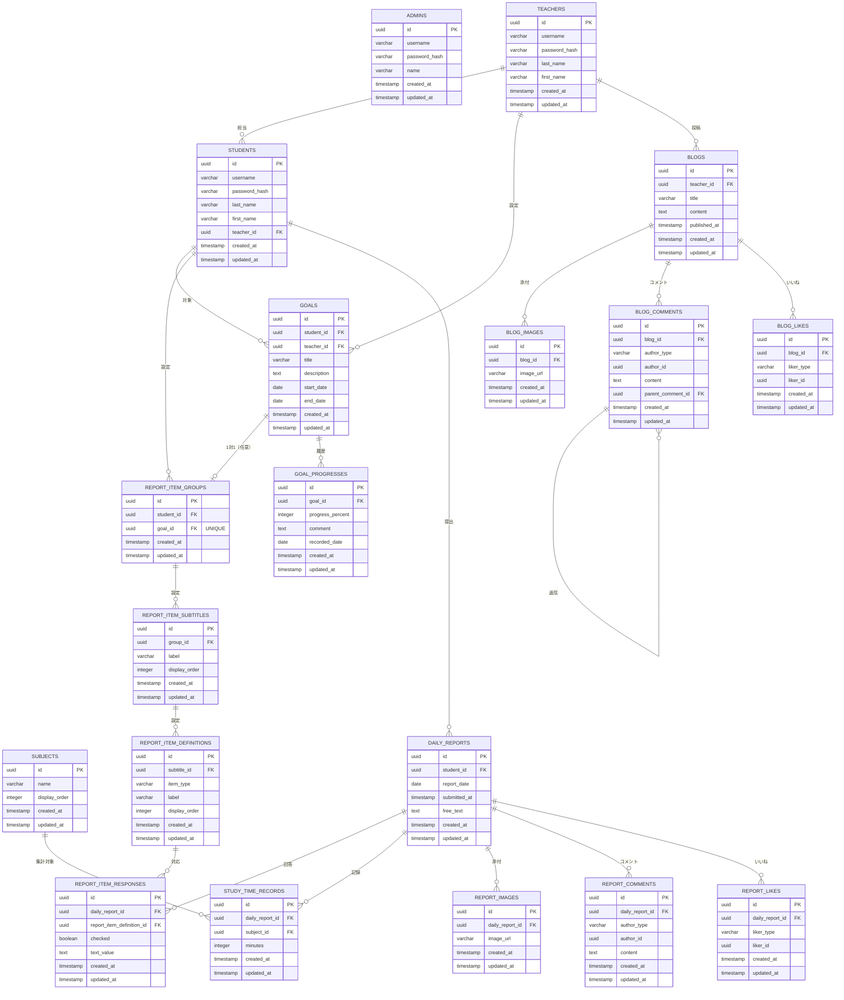

# report-app（レポートアプリ）

## アプリ概要
- 学習塾の生徒・講師向け日報管理アプリ
    - 生徒が自分のスマホでログインし、毎日の勉強の記録を提出する
    - 講師は生徒の日報の閲覧やコメントができる

## 生徒向け機能
- ログイン・ログアウト
    - 講師が発行した生徒アカウント情報でログインができる
    - 生徒が自分でアカウントを作成することはできない
- 日報提出機能
    - 毎日の学習内容・理解した内容・課題などを記入し提出する
    - 日報は、チェック項目・テキスト入力欄がある
        - チェック項目の個数や内容、テキスト入力欄のタイトルは、担当講師（または管理者）が目標ごとに設定する
        - 項目は「目標 → 項目グループ → サブタイトル → チェック項目/テキスト項目」という階層で管理され、生徒ごと・目標ごとに異なる項目の日報内容となる（個別最適化ができている）
    - その他項目
        - 教科ごとの勉強時間
    - 画像の添付も可能
    - 自分の日報を提出でき、提出済みの日報にはいいねができる（コメントは閲覧のみ）
    - 他の生徒の日報は閲覧できない
- 講師ブログ閲覧
    - 講師が不定期で投稿したブログを閲覧・いいねできる（コメントは閲覧のみ）
- 進捗確認ダッシュボード
    - 講師が設定した目標と、その目標に対しての進捗が表示される
        - 進度の管理は講師が行う
    - 日報の連続提出日数も表示される
    - 講師からの評価・進捗

## 講師向け機能
- ログイン・ログアウト
    - 管理者が発行した講師アカウント情報でログインができる
    - 講師が自分でアカウントを作成することはできない
- 生徒の日報閲覧
    - 生徒が提出した日報の内容を閲覧・コメント・いいねなどができる
    - 全生徒に対して閲覧・コメント・いいねを実行できる（生徒は自分の日報を閲覧・いいねできる）
- ブログ機能
    - 講師がブログを作成・投稿できる
    - 生徒へのメッセージや日記などを投稿
    - 画像の添付も可能
    - 生徒からのコメントに返信したり、他の講師のブログも閲覧することができる
- 生徒管理機能
    - 管理者が生徒ごとに担当講師を設定する
    - 講師は、自分の担当生徒の一覧や学習状況（連続提出日数など）を確認できる
    - その生徒の目標（開始日・終了日を持つ期間付き）設定や進捗の入力を行うことができる（同一生徒内で期間が重複する目標は登録できない）
    - 目標ごとに日報項目（項目グループ・サブタイトル・チェック項目/テキスト項目、並び替え含む）を設定できる

## 管理者向け機能
- ログイン・ログアウト
    - 登録されたアカウント情報でログインができる
    - 自分でアカウントを作成することはできない
    - 初期データとして管理者アカウント1件をマイグレーションで投入済み（`admin` / `admin123`）
- 講師登録
    - 講師アカウントの発行
    - 担当生徒のアサインも実行できる
- 生徒登録
    - 生徒アカウントの発行
    - 管理者アカウントは、全生徒の管理機能の実行権限がある
    - 生徒アカウントの削除も可能（目標・日報・コメント・いいね等の関連データも連動して削除される）
- パスワード再発行機能
    - 講師アカウント・生徒アカウントともに、申請があればパスワードを再発行することができる
    - 申請は学習塾でアナログで行うため、申請関連の機能は不要
- 日報・ブログの閲覧機能
    - 生徒の日報を全件閲覧できる（講師は提出済みの日報のみ閲覧可能なのに対し、管理者はそれ以外の状態のものも含めて確認できる）
    - 講師のブログを、下書き（未公開）も含めて全件閲覧できる
    - コメント・画像も含めて閲覧できるが、管理者自身がコメントを投稿したり、いいねをしたり、ブログを新規投稿したりすることはできない
- 日報・ブログのモデレーション機能
    - 不適切な日報・ブログ本体や、日報・ブログへのコメントを削除できる（削除のみで、投稿・編集権限はない）

## リアルタイム更新（WebSocket）
- 日報コメント・ブログコメントの更新と、生徒の日報提出を、画面リロード不要でリアルタイムに配信するバックエンド基盤
    - STOMP over WebSocket（`/ws`エンドポイント、SockJSフォールバックなし）で、サーバーからクライアントへの一方向配信のみを行う
    - コメントの投稿・更新・削除や日報提出は既存のREST APIで行い、DB書き込み成功後にWebSocketで通知を配信する（生徒はコメントの閲覧・購読のみ）
    - 配信トピック
        - 日報コメント：`/topic/reports/{studentId}/{reportDate}/comments`（該当生徒本人、または講師・管理者が購読可能）
        - ブログコメント：`/topic/blogs/{blogId}/comments`（認証済みの生徒・講師・管理者なら購読可能）
        - 日報提出通知：`/topic/report-submissions`（講師・管理者向けのグローバルトピック。生徒による日報提出のたびに通知され、講師・管理者画面のリアルタイム更新に利用する想定。生徒は購読不可）
    - WebSocketのハンドシェイクは既存のログインセッション（Cookie）を再利用して認証し、購読リクエストごとにチャンネル単位でアクセス権を検証する
    - フロントエンドは`@stomp/stompjs`で購読し、コメント一覧はその場に反映、日報提出は講師・管理者画面にトースト通知として表示する（詳細は「フロントエンド構成・設計」を参照）

## セキュリティ
- 認証・認可
    - SpringSecurityによるセッションCookie認証。管理者・講師・生徒でログインエンドポイント／認可ルールを分離している
    - 更新系リクエスト（POST/PUT/DELETE）にはCSRFトークンが必須（`csrf.spa()`、`XSRF-TOKEN`Cookie）
- 添付画像ファイルへのアクセス制御
    - 日報・ブログへの添付画像は`GET /api/files/{filename}`経由でのみ配信され、静的ファイル配信（`/uploads/**`の直接公開）は行わない
    - リクエストごとに画像の紐づく日報・ブログを逆引きし、リクエストしたユーザーのロール・本人性に応じて閲覧可否を判定する（例：他の生徒の日報画像や、未提出の日報・未公開ブログの画像は、権限のないユーザーからは閲覧できない）
    - ファイル名からのパストラバーサル（`../`等によるアップロードディレクトリ外へのアクセス）を防止する

## 技術スタック
- バックエンド
    - Java（SpringBoot）
    - SpringSecurityでログイン認証・認可を行う
    - データアクセスはMyBatis（Mapperインターフェース + XMLマッピング）で行う
    - apiを作成し、フロントエンドにレスポンスを返す
    - WebSocket（STOMP）でコメント・日報提出のリアルタイム配信を行う
- フロントエンド
    - Next.js（App Router, TypeScript, React）
    - バックエンドのapiを叩くことでデータのCRUD操作を行う（詳細は「フロントエンド構成・設計」を参照）
    - cookie、セッション情報を用いてログイン状態を識別する（Next.js側にproxyは設けず、別オリジンのバックエンドへ直接リクエストする）
    - `@stomp/stompjs`でWebSocket（STOMP）に接続し、コメント・日報提出のリアルタイム通知を受信する
- DB
    - PostgreSQL
    - dockerファイルでバージョンや初期化・停止を管理する

## DB設計

### ER図

※ `ADMINS` は他テーブルとの関連を持たない（管理者アカウントはマイグレーション（`V4__seed_admin.sql`）で1件のみ初期投入する運用のため）

### テーブル一覧と役割
| テーブル | 役割 |
|---|---|
| admins | 管理者アカウント |
| teachers | 講師アカウント（`last_name`/`first_name`で氏名を保持） |
| students | 生徒アカウント（担当講師を`teacher_id`で保持、`last_name`/`first_name`で氏名を保持） |
| subjects | 教科マスタ（主要5科目＋副教科4つ＋その他の固定10件、`V2__seed_subjects.sql`で投入） |
| goals | 講師（または管理者）が生徒に設定する目標（`start_date`/`end_date`で期間を管理） |
| report_item_groups | 目標に紐づく日報項目のグループ（`student_id`を保持し、`goal_id`は1目標につき1グループのUNIQUE制約） |
| report_item_subtitles | 項目グループ内のサブタイトル（`display_order`で表示順を管理） |
| report_item_definitions | サブタイトルに属する日報項目（チェック項目/テキスト項目）の定義 |
| daily_reports | 生徒が提出する日報本体（1生徒1日1件、`student_id`+`report_date`でUNIQUE。下書きは廃止済みで、`submitted_at`は提出時に確定する） |
| report_item_responses | 日報項目定義に対する回答（チェック結果/テキスト入力） |
| study_time_records | 日報ごとの教科別勉強時間 |
| report_images | 日報への添付画像 |
| report_comments | 日報へのコメント（`author_type`(`STUDENT`/`TEACHER`)と`author_id`で投稿者を識別。既存の生徒コメントは保持・閲覧でき、新規投稿は講師が行う） |
| report_likes | 日報への「いいね」（`liker_type`/`liker_id`で生徒・講師どちらの「いいね」かを識別、`UNIQUE(daily_report_id, liker_type, liker_id)`） |
| goal_progresses | 目標に対する進捗の記録（履歴として複数回記録） |
| blogs | 講師が投稿するブログ |
| blog_images | ブログへの添付画像 |
| blog_comments | ブログへのコメント（`author_type`(`STUDENT`/`TEACHER`)と`author_id`で投稿者を識別、`parent_comment_id`で自己参照し返信を表現。既存の生徒コメントは保持・閲覧でき、新規投稿は講師が行う） |
| blog_likes | ブログへの「いいね」（`liker_type`/`liker_id`で生徒・講師どちらの「いいね」かを識別） |

### 設計方針
- **主キーはUUID**：全テーブルの`id`は`UUID`型、`DEFAULT gen_random_uuid()`で自動生成（PostgreSQL 16のコア関数、拡張不要）。
- **created_at / updated_atを全テーブルに付与**：両カラムとも`DEFAULT now()`。加えて`updated_at`はPL/pgSQLトリガー（`set_updated_at()`関数を各テーブルの`BEFORE UPDATE`で実行）によりDB側で自動更新される。
- **ポリモーフィックな関連**：`blog_comments`/`blog_likes`と同様に、`report_comments`/`report_likes`も投稿者・いいね実行者が生徒・講師どちらもあり得るため、`〜_type`（`STUDENT`/`TEACHER`）と`〜_id`の組で表現し、外部キー制約は付けていない。
- **目標駆動の日報項目階層**：日報項目は生徒に直接紐づくのではなく、「目標(`goals`) → 項目グループ(`report_item_groups`) → サブタイトル(`report_item_subtitles`) → 項目定義(`report_item_definitions`)」という階層で管理する。1目標につき項目グループは最大1件（`report_item_groups.goal_id`にUNIQUE制約）。
- **カスケード削除**：管理者による生徒削除などの運用操作を安全に行えるよう、生徒に連なる主要テーブル（goals, goal_progresses, report_item_groups, report_item_subtitles, report_item_definitions, daily_reports, report_item_responses, study_time_records, report_images, report_comments, report_likesなど）は`ON DELETE CASCADE`を設定している。
- **タイムゾーンはJSTに統一**：バックエンドは日時を扱う主要な`.now()`呼び出しに`ZoneId.of("Asia/Tokyo")`を明示し、DBコネクションは`application.yml`の`spring.datasource.hikari.connection-init-sql`（`SET TIME ZONE 'Asia/Tokyo'`）でセッションタイムゾーンをJSTに固定している（Jacksonのシリアライズタイムゾーンも`spring.jackson.time-zone: Asia/Tokyo`で統一）。フロントエンドの日時表示も`Intl`系APIに`timeZone: "Asia/Tokyo"`を明示し、サーバー・クライアントのロケールに依存せずJSTで表示する。
- **スキーマ管理はFlyway**：実際のDDLは`backend/src/main/resources/db/migration/`配下のSQL（`V1__init_schema.sql`, `V2__seed_subjects.sql`, `V3__daily_reports_add_submitted_at.sql`, `V4__seed_admin.sql`, `V5__teachers_students_split_name.sql`（氏名を`last_name`/`first_name`に分割）, `V6__goal_period_and_report_item_hierarchy.sql`（目標の期間化、日報項目のグループ/サブタイトル階層化、カスケード削除の追加）, `V7__report_comments_report_likes_actor_type.sql`（コメント・いいねのポリモーフィック化）, `V8__report_item_group_description.sql`（項目グループへの説明文追加）, `V9__drop_daily_report_text_fields.sql`（`achievement_text`/`reflection_text`の廃止）, `V10__daily_reports_add_free_text.sql`（自由記述`free_text`の追加）, `V11__drop_report_item_group_description.sql`（項目グループの説明文機能の廃止））で管理する。
- **エンティティ実装**：`backend/src/main/java/com/reportapp/reportappbackend/entity/`配下に、上記テーブルへ対応するプレーンなPOJO（`BaseEntity`で`id`/`created_at`/`updated_at`を共通化）を実装済み。データアクセスは`mapper`パッケージのMyBatis Mapperインターフェース + `backend/src/main/resources/mapper/`配下のXMLマッピングで行う。外部キーを持つエンティティは関連オブジェクトを直接持たず、`teacher_id`のようなFKカラムに対応する`teacherId`（UUID）フィールドとして表現する。

## APIエンドポイント一覧
すべて`/api`配下。GET以外の更新系リクエストにはCSRFトークンが必要。パスパラメータの`{studentId}`等はUUID、`{reportDate}`は`yyyy-MM-dd`形式の日付。

### 認証（未ログインでも利用可）
| メソッド | パス | 説明 |
|---|---|---|
| GET | `/api/auth/csrf` | CSRFトークンを発行（Cookieにセット） |
| POST | `/api/auth/admin/login` | 管理者ログイン |
| POST | `/api/auth/teacher/login` | 講師ログイン |
| POST | `/api/auth/student/login` | 生徒ログイン |
| POST | `/api/auth/logout` | ログアウト |
| GET | `/api/auth/me` | ログイン中のユーザー情報を取得 |

### 生徒向け
| メソッド | パス | 説明 |
|---|---|---|
| GET | `/api/student/subjects` | 教科マスタ一覧 |
| GET | `/api/student/teachers` | 講師一覧 |
| GET | `/api/student/report-item-definitions` | 自分に設定された日報項目一覧（目標・グループ・サブタイトル情報を含む） |
| GET | `/api/student/reports` | 自分の日報一覧 |
| GET | `/api/student/reports/{reportDate}` | 自分の日報詳細 |
| PUT | `/api/student/reports/{reportDate}` | 日報の提出（新規作成時に即時提出）・更新 |
| DELETE | `/api/student/reports/{reportDate}` | 自分の日報を削除 |
| GET | `/api/student/reports/{reportDate}/comments` | 自分の日報へのコメント一覧（閲覧のみ） |
| GET | `/api/student/reports/{reportDate}/likes` | 自分の日報への「いいね」状態取得 |
| POST | `/api/student/reports/{reportDate}/likes` | 自分の日報に「いいね」 |
| DELETE | `/api/student/reports/{reportDate}/likes` | 「いいね」を取り消し |
| GET | `/api/student/reports/{reportDate}/images` | 自分の日報の添付画像一覧 |
| POST | `/api/student/reports/{reportDate}/images` | 自分の日報に画像を添付（`multipart/form-data`、`file`） |
| DELETE | `/api/student/reports/{reportDate}/images/{imageId}` | 添付画像の削除 |
| GET | `/api/student/blogs` | 公開済みブログ一覧 |
| GET | `/api/student/blogs/{blogId}` | 公開済みブログ詳細 |
| GET | `/api/student/blogs/{blogId}/images` | ブログの添付画像一覧 |
| GET | `/api/student/blogs/{blogId}/comments` | ブログのコメント一覧（閲覧のみ） |
| GET | `/api/student/blogs/{blogId}/likes` | ブログへの「いいね」状態取得 |
| POST | `/api/student/blogs/{blogId}/likes` | ブログに「いいね」 |
| DELETE | `/api/student/blogs/{blogId}/likes` | ブログの「いいね」を取り消し |
| GET | `/api/student/goals` | 自分に設定された目標一覧 |
| GET | `/api/student/goals/{goalId}/progresses` | 目標の進捗履歴一覧 |
| GET | `/api/student/dashboard` | 進捗確認ダッシュボード（目標・進捗・連続提出日数） |

### 講師向け
| メソッド | パス | 説明 |
|---|---|---|
| GET | `/api/teacher/students` | 自分の担当生徒一覧 |
| GET | `/api/teacher/students/all` | 全生徒一覧 |
| GET | `/api/teacher/students/{studentId}/dashboard` | 生徒の進捗確認ダッシュボード（目標・進捗・連続提出日数） |
| GET | `/api/teacher/students/{studentId}/reports` | 生徒の提出済み日報一覧 |
| GET | `/api/teacher/students/{studentId}/reports/{reportDate}` | 生徒の提出済み日報詳細（未提出の場合は404） |
| GET | `/api/teacher/students/{studentId}/reports/{reportDate}/comments` | 日報へのコメント一覧 |
| POST | `/api/teacher/students/{studentId}/reports/{reportDate}/comments` | 日報へコメント投稿 |
| PUT | `/api/teacher/students/{studentId}/reports/{reportDate}/comments/{commentId}` | 自分のコメントを編集 |
| DELETE | `/api/teacher/students/{studentId}/reports/{reportDate}/comments/{commentId}` | 自分のコメントを削除 |
| GET | `/api/teacher/students/{studentId}/reports/{reportDate}/likes` | 日報への「いいね」状態取得 |
| POST | `/api/teacher/students/{studentId}/reports/{reportDate}/likes` | 日報に「いいね」 |
| DELETE | `/api/teacher/students/{studentId}/reports/{reportDate}/likes` | 日報の「いいね」を取り消し |
| GET | `/api/teacher/students/{studentId}/reports/{reportDate}/images` | 日報の添付画像一覧 |
| GET | `/api/teacher/students/{studentId}/report-item-groups` | 生徒の日報項目グループ一覧 |
| POST | `/api/teacher/students/{studentId}/report-item-groups` | 項目グループの作成（目標1件につき1グループ） |
| DELETE | `/api/teacher/students/{studentId}/report-item-groups/{groupId}` | 項目グループの削除 |
| GET | `/api/teacher/students/{studentId}/report-item-groups/{groupId}/subtitles` | サブタイトル一覧 |
| POST | `/api/teacher/students/{studentId}/report-item-groups/{groupId}/subtitles` | サブタイトルの作成 |
| PUT | `/api/teacher/students/{studentId}/report-item-groups/{groupId}/subtitles/{subtitleId}` | サブタイトルの更新 |
| DELETE | `/api/teacher/students/{studentId}/report-item-groups/{groupId}/subtitles/{subtitleId}` | サブタイトルの削除 |
| GET | `/api/teacher/students/{studentId}/report-item-groups/{groupId}/subtitles/{subtitleId}/items` | 日報項目一覧 |
| POST | `/api/teacher/students/{studentId}/report-item-groups/{groupId}/subtitles/{subtitleId}/items` | 日報項目の作成 |
| PUT | `/api/teacher/students/{studentId}/report-item-groups/{groupId}/subtitles/{subtitleId}/items/reorder` | 日報項目の並び替え |
| PUT | `/api/teacher/students/{studentId}/report-item-groups/{groupId}/subtitles/{subtitleId}/items/{itemId}` | 日報項目の更新 |
| DELETE | `/api/teacher/students/{studentId}/report-item-groups/{groupId}/subtitles/{subtitleId}/items/{itemId}` | 日報項目の削除 |
| GET | `/api/teacher/students/{studentId}/goals` | 生徒の目標一覧 |
| GET | `/api/teacher/students/{studentId}/goals/{goalId}` | 目標詳細 |
| POST | `/api/teacher/students/{studentId}/goals` | 目標の作成（`startDate`/`endDate`で期間を指定） |
| PUT | `/api/teacher/students/{studentId}/goals/{goalId}` | 目標の更新 |
| DELETE | `/api/teacher/students/{studentId}/goals/{goalId}` | 目標の削除 |
| GET | `/api/teacher/students/{studentId}/goals/{goalId}/progresses` | 目標の進捗履歴一覧 |
| POST | `/api/teacher/students/{studentId}/goals/{goalId}/progresses` | 進捗の記録 |
| PUT | `/api/teacher/students/{studentId}/goals/{goalId}/progresses/{progressId}` | 進捗の更新 |
| DELETE | `/api/teacher/students/{studentId}/goals/{goalId}/progresses/{progressId}` | 進捗の削除 |
| GET | `/api/teacher/blogs` | 自分のブログ一覧（下書き含む） |
| GET | `/api/teacher/blogs/published` | 公開済みブログ一覧（他講師の分も含む） |
| GET | `/api/teacher/blogs/{blogId}` | ブログ詳細（自分の下書き、または公開済みのもの） |
| POST | `/api/teacher/blogs` | ブログの新規作成（下書き） |
| PUT | `/api/teacher/blogs/{blogId}` | 自分のブログを編集 |
| POST | `/api/teacher/blogs/{blogId}/publish` | 自分のブログを公開 |
| DELETE | `/api/teacher/blogs/{blogId}` | 自分のブログを削除 |
| GET | `/api/teacher/blogs/{blogId}/images` | ブログの添付画像一覧 |
| POST | `/api/teacher/blogs/{blogId}/images` | 自分のブログに画像を添付（`multipart/form-data`、`file`） |
| DELETE | `/api/teacher/blogs/{blogId}/images/{imageId}` | 添付画像の削除 |
| GET | `/api/teacher/blogs/{blogId}/comments` | ブログのコメント一覧 |
| POST | `/api/teacher/blogs/{blogId}/comments` | ブログへコメント投稿 |
| PUT | `/api/teacher/blogs/{blogId}/comments/{commentId}` | 自分のコメントを編集 |
| DELETE | `/api/teacher/blogs/{blogId}/comments/{commentId}` | 自分のコメントを削除 |
| GET | `/api/teacher/blogs/{blogId}/likes` | ブログへの「いいね」状態取得 |
| POST | `/api/teacher/blogs/{blogId}/likes` | ブログに「いいね」 |
| DELETE | `/api/teacher/blogs/{blogId}/likes` | ブログの「いいね」を取り消し |

### 管理者向け
| メソッド | パス | 説明 |
|---|---|---|
| GET | `/api/admin/teachers` | 講師一覧 |
| GET | `/api/admin/teachers/{id}` | 講師詳細 |
| POST | `/api/admin/teachers` | 講師アカウントの発行（担当生徒のアサインを含む） |
| PUT | `/api/admin/teachers/{id}` | 講師情報の更新 |
| POST | `/api/admin/teachers/{id}/password` | 講師のパスワード再発行 |
| GET | `/api/admin/students` | 生徒一覧 |
| GET | `/api/admin/students/{id}` | 生徒詳細 |
| POST | `/api/admin/students` | 生徒アカウントの発行 |
| PUT | `/api/admin/students/{id}` | 生徒情報の更新（担当講師の変更を含む） |
| POST | `/api/admin/students/{id}/password` | 生徒のパスワード再発行 |
| DELETE | `/api/admin/students/{id}` | 生徒アカウントの削除（目標・日報等の関連データも連動して削除） |
| GET | `/api/admin/students/{id}/dashboard` | 生徒の進捗確認ダッシュボード |
| GET | `/api/admin/students/{studentId}/report-item-groups` | 生徒の日報項目グループ一覧 |
| POST | `/api/admin/students/{studentId}/report-item-groups` | 項目グループの作成（目標1件につき1グループ） |
| DELETE | `/api/admin/students/{studentId}/report-item-groups/{groupId}` | 項目グループの削除 |
| GET | `/api/admin/students/{studentId}/report-item-groups/{groupId}/subtitles` | サブタイトル一覧 |
| POST | `/api/admin/students/{studentId}/report-item-groups/{groupId}/subtitles` | サブタイトルの作成 |
| PUT | `/api/admin/students/{studentId}/report-item-groups/{groupId}/subtitles/{subtitleId}` | サブタイトルの更新 |
| DELETE | `/api/admin/students/{studentId}/report-item-groups/{groupId}/subtitles/{subtitleId}` | サブタイトルの削除 |
| GET | `/api/admin/students/{studentId}/report-item-groups/{groupId}/subtitles/{subtitleId}/items` | 日報項目一覧 |
| POST | `/api/admin/students/{studentId}/report-item-groups/{groupId}/subtitles/{subtitleId}/items` | 日報項目の作成 |
| PUT | `/api/admin/students/{studentId}/report-item-groups/{groupId}/subtitles/{subtitleId}/items/reorder` | 日報項目の並び替え |
| PUT | `/api/admin/students/{studentId}/report-item-groups/{groupId}/subtitles/{subtitleId}/items/{itemId}` | 日報項目の更新 |
| DELETE | `/api/admin/students/{studentId}/report-item-groups/{groupId}/subtitles/{subtitleId}/items/{itemId}` | 日報項目の削除 |
| GET | `/api/admin/students/{studentId}/goals` | 生徒の目標一覧 |
| GET | `/api/admin/students/{studentId}/goals/{goalId}` | 目標詳細 |
| POST | `/api/admin/students/{studentId}/goals` | 目標の作成（`startDate`/`endDate`で期間を指定） |
| PUT | `/api/admin/students/{studentId}/goals/{goalId}` | 目標の更新 |
| DELETE | `/api/admin/students/{studentId}/goals/{goalId}` | 目標の削除 |
| GET | `/api/admin/students/{studentId}/goals/{goalId}/progresses` | 目標の進捗履歴一覧 |
| POST | `/api/admin/students/{studentId}/goals/{goalId}/progresses` | 進捗の記録 |
| PUT | `/api/admin/students/{studentId}/goals/{goalId}/progresses/{progressId}` | 進捗の更新 |
| DELETE | `/api/admin/students/{studentId}/goals/{goalId}/progresses/{progressId}` | 進捗の削除 |
| GET | `/api/admin/students/{studentId}/reports` | 生徒の日報一覧（未提出のものも含む・閲覧のみ） |
| GET | `/api/admin/students/{studentId}/reports/{reportDate}` | 生徒の日報詳細（未提出のものも含む・閲覧のみ） |
| DELETE | `/api/admin/students/{studentId}/reports/{reportDate}` | 日報の削除（モデレーション。投稿・編集権限はない） |
| GET | `/api/admin/students/{studentId}/reports/{reportDate}/comments` | 日報のコメント一覧（閲覧のみ） |
| DELETE | `/api/admin/students/{studentId}/reports/{reportDate}/comments/{commentId}` | 日報コメントの削除（モデレーション。投稿権限はない） |
| GET | `/api/admin/students/{studentId}/reports/{reportDate}/images` | 日報の添付画像一覧（閲覧のみ） |
| GET | `/api/admin/blogs` | 全ブログ一覧（下書き含む・閲覧のみ） |
| GET | `/api/admin/blogs/{blogId}` | ブログ詳細（下書き含む・閲覧のみ） |
| GET | `/api/admin/blogs/{blogId}/comments` | ブログのコメント一覧（閲覧のみ） |
| GET | `/api/admin/blogs/{blogId}/images` | ブログの添付画像一覧（閲覧のみ） |
| DELETE | `/api/admin/blogs/{blogId}` | ブログの削除（モデレーション。投稿権限はない） |
| DELETE | `/api/admin/blogs/{blogId}/comments/{commentId}` | コメントの削除（モデレーション。投稿権限はない） |

### ファイル配信
| メソッド | パス | 説明 |
|---|---|---|
| GET | `/api/files/{filename}` | 日報・ブログへの添付画像を配信。リクエストしたユーザーのロール・本人性に応じて閲覧可否を判定する |

## フロントエンド構成・設計

### ディレクトリ構成
```
frontend/src/
├── app/
│   ├── layout.tsx          # ルートレイアウト（AuthProviderで全体をラップ）
│   ├── page.tsx            # "/"：ログイン状態とロールに応じて /admin, /teacher, /student, /login へリダイレクトのみ行う
│   ├── globals.css          # 全ページ共通のデザイントークン・クラス（page, card, btn, alert, toast-banner等）
│   ├── login/
│   │   ├── page.tsx         # ロール選択ページ（3つのログインページへのリンクのみ。フォームは持たない）
│   │   ├── admin/page.tsx   # 管理者ログインフォーム
│   │   ├── teacher/page.tsx # 講師ログインフォーム
│   │   └── student/page.tsx # 生徒ログインフォーム
│   ├── student/              # 生徒向けページ（layout.tsx が認可ガード＋ナビゲーションを担当）
│   │   ├── reports/           # 日報一覧・詳細（[date]）
│   │   ├── blogs/              # 講師ブログの閲覧
│   │   └── settings/           # パスワード変更等
│   ├── teacher/              # 講師向けページ（同上）
│   │   ├── students/           # 担当生徒一覧・詳細（[studentId]）・日報閲覧（reports/[date]）
│   │   ├── reports/             # 自分の担当生徒の日報一覧
│   │   ├── goals/                # 生徒の目標設定
│   │   ├── report-items/         # 日報項目（グループ・サブタイトル・項目）の設定
│   │   ├── blogs/                 # 自分のブログの一覧・新規作成（new）・編集（[blogId]）
│   │   └── settings/               # パスワード変更等
│   └── admin/                 # 管理者向けページ（同上）
│       ├── students/            # 生徒一覧・新規登録（new）・編集/パスワード再発行（[studentId]/edit, /reset-password）
│       ├── teachers/             # 講師一覧・新規登録（new）・編集/パスワード再発行（[teacherId]/edit, /reset-password）
│       ├── goals/                  # 生徒の目標設定
│       ├── report-items/           # 日報項目の設定
│       ├── reports/                 # 生徒の日報閲覧・モデレーション（[studentId]）
│       ├── blogs/                    # ブログの閲覧・モデレーション（[blogId]）
│       └── settings/                  # パスワード変更等
├── components/               # 複数ページ・複数ロールで共有するUIコンポーネント
│   ├── AppHeader.tsx          # 各ロールのナビゲーションバー
│   ├── LoginForm.tsx           # ログインフォーム本体（login/{admin,teacher,student}/page.tsxが利用）
│   ├── ReportItemsManager.tsx  # 日報項目（グループ・サブタイトル・項目）設定UI（講師・管理者で共有）
│   ├── BlogFeedCard.tsx         # ブログ投稿カード
│   ├── ImageCarousel.tsx        # 添付画像カルーセル
│   ├── CommentActionsMenu.tsx   # コメントの編集・削除メニュー
│   └── icons.tsx                 # SVGアイコン集
├── context/
│   └── AuthContext.tsx      # ログイン状態（CurrentUser）をアプリ全体で共有するReact Context
└── lib/
    ├── api.ts               # バックエンドAPIクライアント（fetchラッパー・CSRF処理）
    ├── types.ts             # バックエンドDTOに対応する型定義
    └── ws.ts                # STOMP over WebSocketクライアント（購読ヘルパー）
```
ロールごとに`app/{student,teacher,admin}/`以下でディレクトリを分け、Next.jsのApp Router（ファイルベースルーティング）にそのままURL構造を対応させている（例：`app/teacher/students/[studentId]/reports/[date]/page.tsx` → `/teacher/students/{studentId}/reports/{date}`）。

### ルーティングと認可ガード
- 各ロールディレクトリの`layout.tsx`が、そのロール配下すべてのページに共通する認可チェックとナビゲーションバーを担当する。
    - `useAuth()`で取得した`user`が存在しない、またはロールが一致しない場合は`/login`へリダイレクトする（クライアントサイドでの認可であり、実際のデータ取得・更新はサーバー側のSpring Securityによる認可に依存する）。
    - 認可チェック中・未確定の間は`読み込み中...`のスピナー表示に留め、チェック未完了のまま子ページの内容を描画しない。
- ルート（`/`）は何も表示せず、ログイン状態とロールに応じて`/admin`・`/teacher`・`/student`・`/login`のいずれかへ即座にリダイレクトするだけのエントリーポイントとして機能する。

### 状態管理
- グローバルな状態はログイン中ユーザー情報（`AuthContext`）のみ。それ以外のデータ（日報一覧・コメント等）は各ページコンポーネントが`useEffect`内で`lib/api.ts`のAPI関数を呼び出し、ローカルな`useState`で保持する（Reduxやサーバーステートライブラリ（React Query等）は導入していない、ページ単位で完結する設計）。
- `AuthContext`は初回マウント時に`GET /api/auth/me`を呼んで既存セッション（Cookie）の有無を確認し、ログイン中ユーザーを復元する。ログイン・ログアウト操作もこのContext経由で行い、成功時に`user`state を更新する。

### APIクライアント（`lib/api.ts`）
- バックエンドの`/api`エンドポイントを叩く薄いfetchラッパー。ロール別に`authApi` / `studentApi` / `teacherApi` / `adminApi`の名前空間に分けて、対応するREST APIエンドポイント一覧のメソッドを1対1で提供する。
- CSRF対応：更新系メソッド（POST/PUT/PATCH/DELETE）の初回呼び出し時に`XSRF-TOKEN`Cookieの有無を確認し、無ければ`GET /api/auth/csrf`を叩いて取得、`X-XSRF-TOKEN`ヘッダーに載せて送信する（同時に複数の更新リクエストが飛んでもCSRF取得は1回だけ行われるようPromiseをキャッシュしている）。
- 全リクエストに`credentials: "include"`を指定し、セッションCookieをバックエンド（別オリジン）宛のリクエストに含める。
- 講師画面・管理者画面は生徒配下のリソース（日報項目定義・目標・進捗）に対してほぼ同じCRUD操作を行うため、`makeItemDefinitionsApi` / `makeGoalsApi`というファクトリ関数でベースパスだけ差し替えて共通化している。
- レスポンスが異常時（`!response.ok`）は`ApiError`（`status`・`message`を持つ）をthrowし、各ページ側で`instanceof ApiError`により表示用エラーメッセージに変換する。
- 添付画像URL（バックエンドが返す相対パス）は`resolveFileUrl()`でAPIベースURLを付与した完全なURLに変換して``タグに渡す。

### WebSocketクライアント（`lib/ws.ts`）
- `@stomp/stompjs`を使い、バックエンドの`/ws`（STOMP over WebSocket）に接続する。接続はモジュール内でシングルトンとして管理し、複数コンポーネントから呼ばれても再接続は行わない。
- `subscribeTopic<T>(destination, onMessage)`を各ページの`useEffect`内で呼び、コンポーネントのアンマウント時に返り値の関数で購読解除する、という統一パターンで利用する。
- 日報コメント・ブログコメントの詳細ページでは、コメント一覧をこの購読で受け取ったイベント（`CommentEvent`）でその場に反映し、画面全体の再取得は行わない。講師・管理者の概要ページでは`REPORT_SUBMISSIONS_TOPIC`を購読し、生徒の日報提出をトースト通知として表示する。

### デザイン・スタイリング
- CSSフレームワークは導入せず、`globals.css`に定義した独自クラス（`page`, `page-header`, `card`, `grid-cards`, `btn`/`btn-ghost`/`btn-sm`, `alert`/`alert-error`, `toast-banner`, `spinner-page`, `app-nav`/`nav-link`等）を各ページで組み合わせて使う。CSS Modulesやstyled-componentsは使用していない。
- `src/app/student/*`のみ、Instagram風のフィードUI（`ig-`プレフィックスのクラス群：`ig-card`, `ig-story-*`, `ig-action-bar`, `ig-comment-*`等）を追加で採用している。講師・管理者向けページはこのスコープの対象外で、共通クラスのみを使ったシンプルな管理画面のスタイルのまま。

### バックエンド連携
- フロントエンドとバックエンドは別オリジン（`http://localhost:3000` / `http://localhost:8080`）で動作し、Next.js側にAPIプロキシは設けていない。APIベースURLは環境変数`NEXT_PUBLIC_API_BASE_URL`（`frontend/.env.local`）で指定する。
- ログイン状態の識別はNext.js側の仕組み（JWTやNextAuth等）ではなく、バックエンドが発行するセッションCookieにすべて委ねている（Next.jsは`credentials: "include"`でこのCookieを送るだけのクライアント）。

## リポジトリ構成
```
report-app/
├── backend/            # Spring Boot (Maven)
├── frontend/           # Next.js (TypeScript, npm)
├── docker-compose.yml   # PostgreSQL
└── .env.example
```

## ローカル環境構築

### 前提
- Java 21
- Node.js 22以上
- Docker / Docker Compose

### 1. DB起動
```bash
cp .env.example .env
docker compose up -d
```

### 2. バックエンド起動
```bash
cd backend
./mvnw spring-boot:run
```
`http://localhost:8080` で起動します。

### 3. フロントエンド起動
```bash
cd frontend
cp .env.local.example .env.local
npm install
npm run dev
```
`http://localhost:3000` で起動します。

### 4. 管理者ログイン
初回起動時にマイグレーションで管理者アカウントが1件投入されているので、そのままログインできます。
- ユーザー名: `admin`
- パスワード: `admin1234`

講師・生徒アカウントは初期データを持たないため、管理者でログイン後、管理画面から発行してください。
